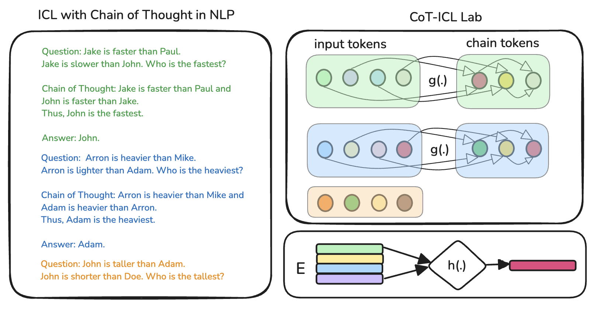

<div align="center">
  <h1>CoT-ICL Lab</h1>
  <p> A Petri Dish for Studying Chain-of-Thought Learning from In-Context Demonstrations.
 </p>
</div>
<br>



****************************************************************

## Setup

- Create a virtual environment and install the package.

```bash
$ python3.12 -m venv .venv
$ source .venv/bin/activate
(.venv) $ pip install -e .
```

- Run unit tests as a sanity check.

```bash
(.venv) $ pytest
```

- (Development) Run ruff + isort fixes to sanitize the code changes.

```bash
(.venv) $ ./beautify.sh
```

## Getting Started

Our framework serves as a test bed to generate synthetic tokenized datasets for training and evaluating transformer models. We do so by using `DAG` and `TokenProcessor` classes. These can be configured directly by the `Args` dataclass. For example:

```py

from tokenized_cot_icl.core.args import Args
from tokenized_cot_icl.core.data import TokenizedDataset

args = Args(
      vocab_size=1024,
      n_inputs=4,
      n_parents=2,
      chain_length=3,
      n_examples=1,
      enable_cot=True,
      prompt_strategy="cot",
      activation="leaky_relu",
      n_tasks=10,
)

dataset = TokenizedDataset(args=args)
print(dataset[0])
```

The above item in the dataset is as follows:

```py
{
    'adj_list': tensor([[0, 2], [4, 3], [5, 3]]),
    'attention_mask': tensor([1, 1, 1, 1, 1, 1, 1]),
    'input_ids': tensor([ 556,  197, 1002,  867,  240,  466,  217]),
    'labels': tensor([-100, -100, -100, -100,  240,  466,  217]),
    'cot_eval': 
          {
                'attention_mask': tensor([1, 1, 1, 1]),
                'input_ids': tensor([ 556,  197, 1002,  867]),
                'last_example_cot': tensor([240, 466, 217])
          }
}
```

### Understanding the DAG structure

Let's break down the result above to understand the DAG structure. Consider $4$ input tokens ($x_1, x_2, x_3, x_4$) and $3$ chain tokens ($y_1, y_2, y_3$) for the single example above.

The `'adj_list': tensor([[0, 2], [4, 3], [5, 3]])` (based on zero-indexing) indicates that the parent tokens for the chain tokens are as follows:

- $y_1 \leftarrow \{x_1, x_3\}$
- $y_2 \leftarrow \{y_1, x_4\}$
- $y_3 \leftarrow \{y_2, x_4\}$

>[!NOTE]
> The TokenCoverage metric introduced in the paper relies on the uniqueness of chain tokens in the entire dataset and depends heavily on the "vocab_size" and "activation". Thus controlling the difficulty of the tasks.

## Training

### Setting the `TASK_CARD`

To make it suitable for bulk launching the experiments, we rely on a `TASK_CARD` to collate all the args. For instance, to train a model with the args as per the above example, we do:

```py
# tokenized_cot_icl/core/task_card.py

def custom_task_card() -> Dict[int, Args]:
    """A custom task card."""    
      args = Args(
            vocab_size=1024,
            n_inputs=4,
            n_parents=2,
            chain_length=3,
            n_examples=1,
            enable_cot=True,
            prompt_strategy="cot",
            activation="leaky_relu",
            n_tasks=10,
      )
    return {0: args}

# set the dictionary
TASK_CARD = custom_task_card()
```

### Launch the DDP Training

The `TASK_CARD` allows us to index into the experimental config of our choice and launch the torch distributed data parallel (DDP) training runs. For example:

```bash
(.venv) $ cd src &&  python tokenized_cot_icl/core/train.py --task_card_key 0
```


## License

[MIT License](LICENSE)

## Citation

```bibtex
@misc{kothapalli2025coticllabpetridish,
      title={CoT-ICL Lab: A Petri Dish for Studying Chain-of-Thought Learning from In-Context Demonstrations}, 
      author={Vignesh Kothapalli and Hamed Firooz and Maziar Sanjabi},
      year={2025},
      eprint={2502.15132},
      archivePrefix={arXiv},
      primaryClass={cs.CL},
      url={https://arxiv.org/abs/2502.15132}, 
}
```