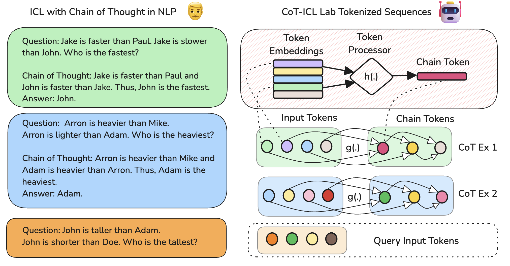

<div align="center">
  <h1>CoT-ICL Lab</h1>
  <p> A Synthetic Framework for Studying Chain-of-Thought Learning from In-Context Demonstrations
 </p>
</div>
<br>



****************************************************************

## Announcements

- New version of the framework to be out soon!!
- [2025.05] :tada: The ["CoT-ICL Lab"](https://aclanthology.org/2025.acl-long.712/) paper has been accepted to ACL Main 2025!

****************************************************************

## Setup

We use [pixi](https://pixi.sh) to manage environments and dependencies. Install it once via `curl -fsSL https://pixi.sh/install.sh | bash` (or see the [pixi docs](https://pixi.sh/latest/#installation)).

- Install the default environment (CPU-only; works on macOS arm64 and Linux):

```bash
$ pixi install
```

- Install the CUDA training environment (Linux x86-64; pulls in `torch==2.4.0+cu118`, `triton`, and `liger-kernel`):

```bash
$ pixi install -e cuda
```

- Run the unit tests:

```bash
$ pixi run test
```

- Run ruff + isort fixes to sanitize the code changes:

```bash
$ pixi run beautify
```

- Drop into an interactive shell with the env activated:

```bash
$ pixi shell           # default env
$ pixi shell -e cuda   # cuda env
```

## Getting Started

Our framework serves as a test bed to generate synthetic tokenized datasets for training and evaluating transformer models. We do so by using `DAG` and `TokenProcessor` classes. These can be configured directly by the `Args` dataclass. For example:

```py

from tokenized_cot_icl.core.args import Args
from tokenized_cot_icl.core.data import TokenizedDataset

args = Args(
      vocab_size=1024,
      n_inputs=4,
      n_parents=2,
      chain_length=3,
      n_examples=1,
      enable_cot=True,
      prompt_strategy="cot",
      activation="leaky_relu",
      n_tasks=10,
)

dataset = TokenizedDataset(args=args)
print(dataset[0])
```

The above item in the dataset is as follows:

```py
{
    'adj_list': tensor([[0, 2], [4, 3], [5, 3]]),
    'attention_mask': tensor([1, 1, 1, 1, 1, 1, 1]),
    'input_ids': tensor([ 556,  197, 1002,  867,  240,  466,  217]),
    'labels': tensor([-100, -100, -100, -100,  240,  466,  217]),
    'cot_eval':
          {
                'attention_mask': tensor([1, 1, 1, 1]),
                'input_ids': tensor([ 556,  197, 1002,  867]),
                'last_example_cot': tensor([240, 466, 217])
          }
}
```

### Understanding the DAG structure

Let's break down the result above to understand the DAG structure. Consider $4$ input tokens ($x_1, x_2, x_3, x_4$) and $3$ chain tokens ($y_1, y_2, y_3$) for the single example above.

The `'adj_list': tensor([[0, 2], [4, 3], [5, 3]])` (based on zero-indexing) indicates that the parent tokens for the chain tokens are as follows:

<div align="center">

| Chain Token | Parent Tokens    |
|-------------|------------------|
| $y_1$  | $\{x_1, x_3\}$ |
| $y_2$ | $\{y_1, x_4\}$ |
| $y_3$ | $\{y_2, x_4\}$ |

</div>


>[!NOTE]
> The TokenCoverage metric introduced in the paper relies on the uniqueness of chain tokens in the entire dataset and depends heavily on the "vocab_size" and "activation". Thus controlling the difficulty of the tasks.

## Models

We leverage the HuggingFace [transformers](https://github.com/huggingface/transformers) library to create custom Llama models and expose a `MODEL_REGISTRY` to register new model families.

```py
# src/tokenized_cot_icl/core/models.py

MODEL_REGISTRY = {"llama": create_llama_model}
```

>[!TIP]
> Users can register the creation function for models of their choice from the `transformers` library to explore new architectures and validate ideas.


## Training

### Setting the `TASK_CARD`

To make it suitable for bulk launching the experiments, we rely on a `TASK_CARD` to collate all the args. For instance, to train a model with the args as per the above example, we do:

```py
# src/tokenized_cot_icl/core/task_card.py

def custom_task_card() -> Dict[int, Args]:
    """A custom task card."""
      args = Args(...) # set as needed
    return {0: args}

# set the dictionary
TASK_CARD = custom_task_card()
```

### Launch the DDP Training

The `TASK_CARD` allows us to index into the experimental config of our choice and launch the torch distributed data parallel (DDP) training runs. For example:

```bash
$ cd src
$ export NUM_NODES=1 # change as needed
$ export LOCAL_WORLD_SIZE=4 # change as needed
$ pixi run -e cuda torchrun --nnodes=$NUM_NODES --nproc-per-node=$LOCAL_WORLD_SIZE -m tokenized_cot_icl.core.train --task_card_key 0
```

### Metric Logging

- By default, we use `metric_logger="stdout"` in `Args` and log the metrics/params to `STDOUT`.
- We also support logging to an [MLFlow](https://mlflow.org/docs/latest/tracking.html) tracking server by setting the `MLFLOW_SERVICE_URL` environment variable and using `Args(metric_logger="mlflow")`.

### Liger-Kernels

The [Liger-Kernel](https://github.com/linkedin/Liger-Kernel) optimizations can patch the llama models for faster training runs. Liger is included in the `cuda` pixi environment, and is enabled by setting `Args(use_liger_kernels=True)`.

## Inference with vLLM/SGLang

In addition to using the `transformers.GenerationConfig` for small scale inference during the training runs, we also support [vLLM](https://github.com/vllm-project/vllm) and [SGLang](https://github.com/sgl-project/sglang) based evaluation of the trained model (or model checkpoints) to analyze the predictions.

These backends are not installed by the default pixi environments. Add the relevant package(s) to the appropriate `[tool.pixi.feature.*.pypi-dependencies]` section in `pyproject.toml` (typically `cuda`) and re-run `pixi install -e cuda`.

We provide an easy to extend example for calculating the answer token prediction accuracy as follows:

```bash
# for vllm
$ cd src && pixi run -e cuda python tokenized_cot_icl/inference/vllm/evaluator.py \
                        --model_base_dir /opt/cot-icl-lab/run_name \
                        --checkpoint final  # either final or 1000, 2000 etc.

# for sglang
$ cd src && pixi run -e cuda python tokenized_cot_icl/inference/sglang/evaluator.py \
                        --model_base_dir /opt/cot-icl-lab/run_name \
                        --checkpoint final  # either final or 1000, 2000 etc.
```


## License

[MIT License](LICENSE)

## Citation

```bibtex
@inproceedings{Kothapalli2025CoTICLLAB,
  title={CoT-ICL Lab: A Synthetic Framework for Studying Chain-of-Thought Learning from In-Context Demonstrations},
  author={Vignesh Kothapalli and Hamed Firooz and Maziar Sanjabi},
  booktitle={Annual Meeting of the Association for Computational Linguistics},
  year={2025},
}
```
