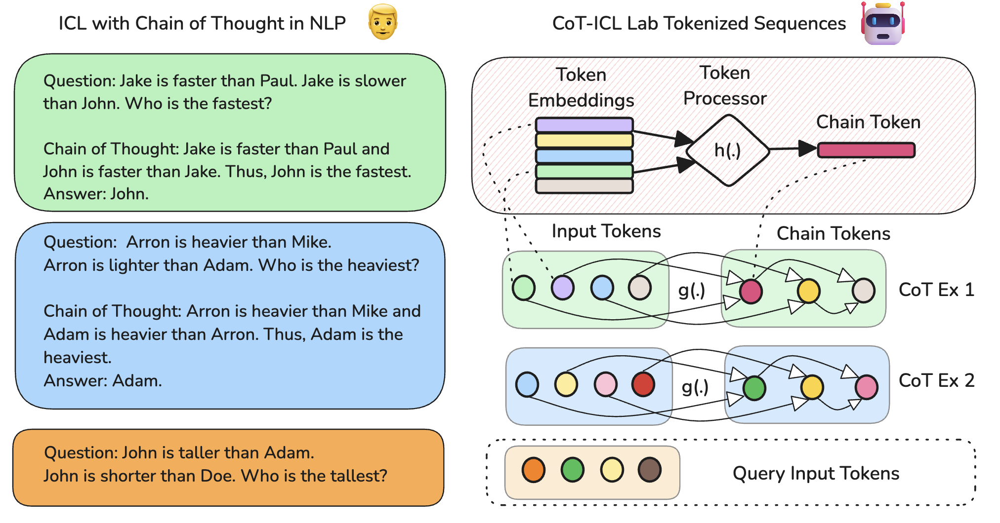

<div align="center">
  <h1>CoT-ICL Lab</h1>
  <p> A Petri Dish for Studying Chain-of-Thought Learning from In-Context Demonstrations.
 </p>
</div>
<br>



****************************************************************

## Setup

- Create a virtual environment and install the package.

```bash
$ python3.12 -m venv .venv
$ source .venv/bin/activate
(.venv) $ pip install -e .
```

- Run unit tests as a sanity check.

```bash
(.venv) $ pytest
```

## License

[MIT License](LICENSE)

## Citation

```bibtex
@misc{kothapalli2025coticllabpetridish,
      title={CoT-ICL Lab: A Petri Dish for Studying Chain-of-Thought Learning from In-Context Demonstrations}, 
      author={Vignesh Kothapalli and Hamed Firooz and Maziar Sanjabi},
      year={2025},
      eprint={2502.15132},
      archivePrefix={arXiv},
      primaryClass={cs.CL},
      url={https://arxiv.org/abs/2502.15132}, 
}
```